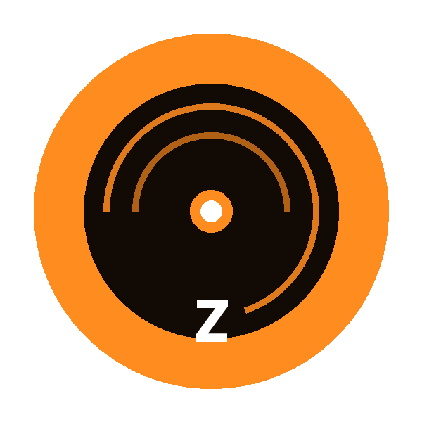
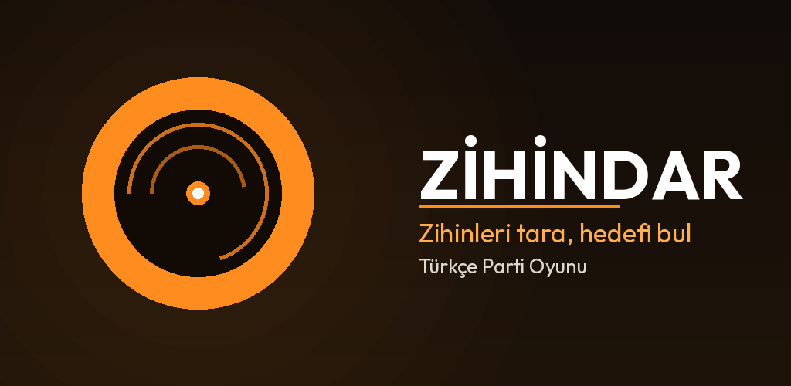
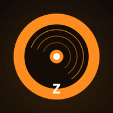

<div align="center">



# Zihindar

### *Zihinleri tara, hedefi bul*

Wavelength masa oyunundan ilham alan, tamamen Türkçe offline parti oyunu.

[](https://flutter.dev)
[](https://developer.android.com)
[](LICENSE)

<br>



</div>

---

## 🎮 Oyun Nedir?

**Zihindar**, 2-8 oyuncu arasında oynanan sosyal bir tahmin oyunudur. Bir oyuncu "lider" olarak iki zıt kavram arasındaki gizli hedefin konumunu görür ve diğer oyunculara bir **ipucu** verir. Takım, ipucunu değerlendirerek spektrum üzerinde tahminde bulunur.

> **Örnek:** Spektrum "Sıkıcı ↔ Eğlenceli" ise ve hedef sağ tarafa yakınsa, lider "Lunapark" gibi bir ipucu verebilir! 🎡

## ✨ Özellikler

| Özellik | Açıklama |
|---------|----------|
| 🇹🇷 **Tamamen Türkçe** | Tüm içerik ve arayüz Türkçe |
| 👥 **2-8 Oyuncu** | Arkadaş grubuyla oynanır |
| 📱 **Offline** | İnternet bağlantısı gerektirmez |
| 🎯 **6 Kategori** | Eğlence, Maceracı, Zihin Oyunları, Klasik, Rekabetçi, Sosyal |
| 🎲 **72+ Spektrum** | Her kategoride 12 farklı zıt kavram çifti |
| 🏆 **Puanlama** | Tahmine göre 0-50 puan arası otomatik puanlama |
| 🌙 **Koyu Tema** | Göz yormayan şık koyu tasarım |

## 📸 Ekran Görüntüleri

> Ekran görüntülerini buraya ekleyebilirsiniz.

## 🚀 Kurulum

### APK İndirme

En güncel APK dosyasını [**Releases**](https://github.com/emirhan-coban/wavelength-turkce/releases) sayfasından indirebilirsiniz.

### Kaynak Koddan Derleme

```bash
# Repository'yi klonla
git clone https://github.com/emirhan-coban/wavelength-turkce.git
cd wavelength-turkce

# Bağımlılıkları yükle
flutter pub get

# APK oluştur
flutter build apk --release
```

## 🎯 Nasıl Oynanır?

```
1️⃣ Oyuncu sayısını belirle (2-8 kişi)
2️⃣ Bir kategori seç (Eğlence, Klasik, vb.)
3️⃣ Lider gizli hedefi görür
4️⃣ Lider, hedefin konumuna uygun bir ipucu söyler
5️⃣ Takım ipucunu tartışır ve kadranı çevirerek tahmin yapar
6️⃣ Hedefe ne kadar yakınsa o kadar puan kazanılır!
```

### Puanlama Sistemi

| Sonuç | Puan |
|-------|------|
| 🎯 Tam isabet | **50** puan |
| 🔥 Çok yakın | **30** puan |
| 👍 İyi | **20** puan |
| 🤏 Yakın | **10** puan |
| ❌ Uzak | **0** puan |

## 🛠️ Teknolojiler

- **Flutter** — Cross-platform UI framework
- **Dart** — Programlama dili
- **Google Fonts** — Plus Jakarta Sans tipografi
- **Material Design 3** — Modern UI bileşenleri

## 📁 Proje Yapısı

```
lib/
├── main.dart              # Uygulama giriş noktası
├── data/
│   └── spectrum_data.dart # Spektrum veri seti (72+ çift)
├── models/
│   ├── game_category.dart # Kategori modeli
│   ├── game_state.dart    # Oyun durumu yönetimi
│   └── player.dart        # Oyuncu modeli
├── screens/
│   ├── home_screen.dart           # Ana ekran
│   ├── player_setup_screen.dart   # Oyuncu ayarları
│   ├── category_selection_screen.dart # Kategori seçimi
│   ├── turn_change_screen.dart    # Sıra değişimi
│   ├── secret_target_screen.dart  # Gizli hedef gösterimi
│   ├── guess_screen.dart          # Tahmin ekranı
│   ├── result_screen.dart         # Tur sonucu
│   ├── game_over_screen.dart      # Oyun sonu
│   └── how_to_play_screen.dart    # Nasıl oynanır
├── theme/
│   └── app_theme.dart     # Tema ve renk paleti
└── widgets/
    ├── spectrum_dial.dart     # Spektrum kadranı
    └── target_indicator.dart  # Hedef göstergesi
```

## 🤝 Katkıda Bulunma

Katkıda bulunmak isterseniz:

1. Bu repository'yi **fork** edin
2. Yeni bir **branch** oluşturun (`git checkout -b feature/yenilik`)
3. Değişikliklerinizi **commit** edin (`git commit -m 'Yeni özellik eklendi'`)
4. Branch'inizi **push** edin (`git push origin feature/yenilik`)
5. Bir **Pull Request** açın

## 📄 Lisans

Bu proje [MIT Lisansı](LICENSE) ile lisanslanmıştır.

---

<div align="center">

**Zihindar** ile arkadaşlarınla unutulmaz anlar yaşa! 🎉



</div>
